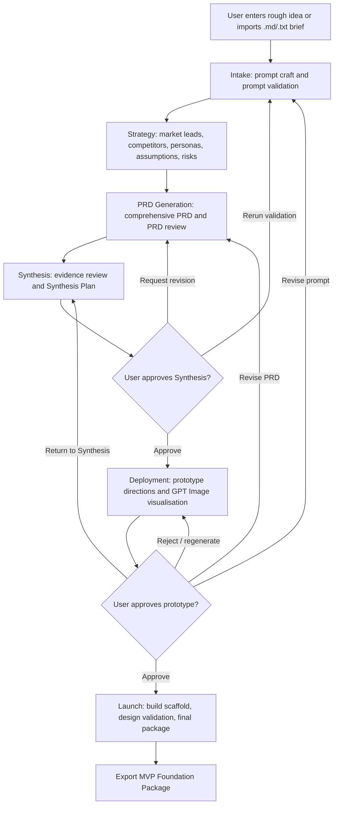

# ConductorIQ

ConductorIQ is an AI-native startup validation and MVP execution workspace. It helps founders turn a rough product idea into an evidence-backed MVP decision through a visible, approval-gated, multi-agent workflow.

The product is designed to answer one early-stage startup question:

> Is this idea worth building, and what should the MVP look like?

ConductorIQ is not a chatbot. It is a local orchestration product that presents the experience of activating an autonomous validation team: prompt architects, market analysts, PRD agents, synthesis critics, prototype agents, design validators, and launch planners working through a structured graph.

## Demo

Watch the ConductorIQ product demo: [https://youtu.be/poWZoBo7eAU](https://youtu.be/poWZoBo7eAU)

## Problem Statement

Founders often move from idea to build too quickly. A rough idea may sound promising, but it usually lacks validation around target users, pain severity, competitive pressure, assumptions, risks, MVP scope, and user willingness to adopt or pay.

The current early-stage workflow is fragmented:

- Ideas are refined in one tool.
- Market notes are gathered elsewhere.
- Competitor analysis is often ad hoc.
- Personas and objections are simulated manually or skipped.
- PRDs are written without enough validation context.
- Prototype decisions are disconnected from strategy.
- Implementation planning starts before the product direction is approved.

This creates a common failure mode: a team builds a polished MVP for an idea that was never validated deeply enough.

ConductorIQ solves this by turning early product validation into a persistent, graph-driven workflow where every downstream artifact depends on upstream evidence.

## Proposed Solution

ConductorIQ provides a six-workspace validation operating system:

1. Intake
2. Strategy
3. PRD Generation
4. Synthesis
5. Deployment
6. Launch

The user enters a rough idea or imports a `.txt` / `.md` brief. ConductorIQ then coordinates specialized agents through a local LangGraph workflow. Each stage produces artifacts, scores, logs, memory entries, and approval states.

The workflow intentionally slows down premature building. Before Launch can produce the final MVP foundation package, the user must pass approval checkpoints:

- The Synthesis Plan must be approved before Deployment unlocks.
- The prototype direction must be approved before Launch/build-preparation outputs unlock.
- Rejection routes keep the workflow locked and send the user back to revision, regeneration, PRD refinement, or Synthesis.

## Core Product Promise

ConductorIQ autonomously coordinates AI agents to validate startup ideas and produce evidence-backed MVP recommendations.

The final output is an MVP Foundation Package containing:

- Improved validation prompt.
- Market leads and evidence signals.
- Competitor hypotheses.
- Persona reactions and objections.
- Assumption tests.
- Risk register.
- Comprehensive PRD artifact.
- PRD review findings.
- Synthesis Plan.
- Prototype direction or generated GPT image asset.
- Approved prototype build scaffold.
- Implementation plan.
- Design validation report.
- Final pursue / refine / reject recommendation.
- Exportable local package.

## Key Features

- Six-workspace product flow with strict top-level navigation scope.
- Local LangGraph `StateGraph` orchestration.
- Visible specialized agent roster with state, progress, dependencies, and outputs.
- Prompt crafting, prompt validation, and prompt improvement.
- Strategy workspace with market leads, competitors, personas, risks, assumption tests, and confidence scoring.
- Comprehensive PRD generation with review findings and quality scoring.
- Synthesis hold state with approve, request revision, and rerun validation controls.
- Deployment prototype generation through GPT Image when available.
- Visual fallback storyboard when image generation is unavailable.
- Prototype approval / rejection gate.
- Launch workspace with prototype build preview, implementation package, and export controls.
- localStorage persistence for workflow state, artifacts, logs, memory, scores, selected workspace, and approval decisions.
- Safe local OpenAI proxy endpoints through the Vite dev server.
- Deterministic fallback when OpenAI or image generation fails.
- Static export as HTML, Markdown, or JSON.

## User Workflow



## Six Workspaces

### Intake

Intake captures the raw idea and turns it into a stronger validation prompt.

Implemented behavior:

- Empty idea guard.
- `.txt` and `.md` import through the browser File API.
- Prompt Readiness Gate.
- Prompt Refinement Studio.
- OpenAI-powered prompt refinement when configured.
- Deterministic improved prompt fallback.
- Prompt quality score and missing-context warnings.
- Initial project memory and workflow initialization.

### Strategy

Strategy validates the product opportunity before any PRD or build planning.

Implemented behavior:

- Market signal generation.
- Market lead cards with buyer type, segment, pain signal, confidence, scoring rationale, and validation question.
- Competitor cards with threat level, positioning gap, and differentiation.
- Persona simulation with objections and willingness-to-pay concerns.
- Assumption tests.
- Risk register.
- Validation confidence and opportunity quality scoring.
- Evidence labels for OpenAI or deterministic fallback output.

### PRD Generation

PRD Generation transforms validation evidence into a structured product requirements artifact.

Implemented behavior:

- Comprehensive PRD artifact.
- Executive summary, problem, users, goals, non-goals, workflows, features, UX, technical direction, acceptance criteria, risks, and roadmap.
- PRD review artifact.
- Section completeness and quality scoring.
- Revision recommendations.
- Long-content safe rendering.

### Synthesis

Synthesis reviews all upstream artifacts before allowing prototype/build progression.

Implemented behavior:

- Review-first Synthesis Plan.
- Pursue / refine / reject recommendation.
- Evidence summary.
- Validation gaps.
- Interface improvement critique.
- Product risks.
- Approval checkpoint.
- Request revision path.
- Rerun validation path.
- Paused state with no hidden background execution.

### Deployment

Deployment prepares prototype direction and execution readiness.

Implemented behavior:

- Prototype option cards.
- Explicit Visualise Prototype internal step.
- GPT Image generation through local proxy when configured.
- Actual generated image rendering when the image API succeeds.
- Deterministic fallback storyboard when image generation fails.
- Prototype telemetry: attempts, status, last attempt, failure reason.
- Prototype approval and rejection controls.
- Rejection routes: regenerate prototype, revise prompt, revise PRD, return to Synthesis.

### Launch

Launch is locked until the prototype direction is approved.

Implemented behavior:

- Prototype Build Preview.
- Approved prototype build scaffold.
- Implementation plan.
- Component map.
- Design Validation Report.
- Final MVP Foundation Package.
- Export to HTML, Markdown, and JSON.
- Readiness dashboard.
- Final recommendation and next actions.

## Agent Orchestration

ConductorIQ uses product-visible agents to make the workflow feel like an autonomous startup validation team.

Core agents include:

- Workflow Supervisor Agent.
- Memory Agent.
- Prompt Architect Agent.
- Prompt Validator Agent.
- Refinement Agent.
- Market Research Agent.
- Competitor Analysis Agent.
- Persona Validation Agent.
- PRD Agent.
- PRD Reviewer Agent.
- UX/UI Agent.
- Interface Improvement Agent.
- GPT Image Agent.
- Prototype Review Agent.
- Designer Agent.
- Architecture Agent.
- MVP Planning Agent.
- QA Critic Agent.
- Build Orchestrator Agent.
- Launch Agent.

Agents expose:

- Current task.
- Execution state.
- Progress.
- Dependency artifacts.
- Output artifacts.
- Last activity.
- Handoff logs.

Agent states are tied to workflow progression rather than random animation. Agents wait on dependencies, critique outputs, revise weak sections, and update artifacts.

## LangGraph Orchestration

LangGraph is the internal orchestration backbone of ConductorIQ.

The application uses `@langchain/langgraph` locally to model the product workflow as a `StateGraph`. The graph coordinates progression across the six workspaces:


The graph state includes:

- Project state.
- Agent states.
- Workflow nodes.
- Artifacts.
- Logs.
- Memory entries.
- Market signals.
- Market leads.
- Competitors.
- Personas.
- Risks.
- Assumption tests.
- Prototype assets.
- Task queue items.
- Approval decisions.
- Branch decisions.

Conditional branch logic supports:

- Synthesis approval.
- Synthesis revision.
- Synthesis rerun.
- Prototype approval.
- Prototype rejection.
- Prototype regeneration.
- Prompt revision.
- PRD revision.
- Return to Synthesis.

The app does not use LangGraph Cloud, hosted checkpointers, queues, workers, or databases. State is serialized into browser storage for a local-first workflow.

## OpenAI and GPT Image Integration

ConductorIQ uses OpenAI through local Vite dev-server proxy endpoints so private keys do not need to be exposed as `VITE_` browser variables.

Local proxy endpoints:

- `/api/conductoriq/openai-validation`
- `/api/conductoriq/agent`
- `/api/conductoriq/gpt-image`

OpenAI is used for:

- Prompt improvement.
- Market synthesis.
- Persona simulation.
- PRD generation.
- PRD review.
- Synthesis critique.
- Interface review.
- Launch package generation.
- GPT Image prototype generation.

If OpenAI is unavailable, times out, or returns insufficient output, ConductorIQ uses deterministic local fallback and labels the result clearly.

Image generation behavior:

- Generated image assets render as actual image previews.
- Fallback assets render as visual storyboard cards.
- Image telemetry is stored with attempt count, status, timestamp, provider, and failure reason.

## Persistence Model

ConductorIQ stores local workflow state in `localStorage`.

Persisted state includes:

- Raw idea.
- Selected workspace.
- Project status.
- Agent states.
- Workflow nodes.
- Artifacts and versions.
- Logs.
- Memory entries.
- Market scores.
- PRD content.
- Synthesis approval.
- Prototype approval / rejection.
- Design validation result.
- Prototype image metadata or fallback prompts.
- Branch decisions.

Reset intentionally clears local state.

## Technical Stack

- React 19.
- TypeScript.
- Vite.
- TailwindCSS v4.
- `@langchain/langgraph`.
- `@langchain/core`.
- OpenAI SDK.
- lucide-react.
- clsx.
- Vitest.
- React Testing Library.
- jsdom.

## Project Structure

```text
ConductorIQ/
  AGENTS.md
  PRD.md
  PROGRESS.md
  Problems.md
  TASK_QUEUE.md
  WHAT_IS_MISSING.md
  Assets/
  src/
    App.tsx
    data.ts
    integrations.ts
    main.tsx
    orchestration.ts
    promptQuality.ts
    runtimePackage.ts
    styles.css
    types.ts
    App.workflow.test.tsx
    exportPackage.test.ts
    orchestration.test.ts
    storageMigration.test.ts
  vite.config.ts
  package.json
```

Important files:

- `src/App.tsx`: main product UI, workspace rendering, approval gates, persistence wiring, export builders.
- `src/orchestration.ts`: local LangGraph workflow, agent output generation, graph nodes, branch routing.
- `src/integrations.ts`: OpenAI, GPT Image, and deterministic fallback integration helpers.
- `src/runtimePackage.ts`: runtime package normalization and progressive workspace reveal.
- `src/promptQuality.ts`: prompt quality analysis and improved prompt fallback generation.
- `src/types.ts`: shared product, graph, artifact, agent, and workflow types.
- `vite.config.ts`: Vite setup and local OpenAI proxy middleware.

## Environment Variables

Create `.env.local` if you want real OpenAI execution.

```bash
OPENAI_API_KEY=your_openai_key_here
OPENAI_TEXT_MODEL=gpt-5.5
OPENAI_IMAGE_MODEL=gpt-image-1.5
```

The proxy also checks `OPENAIKEY` for compatibility with earlier local setup.

Do not expose private keys through `VITE_` variables.

The app still runs without API keys using deterministic fallback output.

## Installation

```bash
npm install
```

## Development

```bash
npm run dev
```

Open:

```text
http://localhost:5173
```

For explicit localhost binding:

```bash
npm run dev -- --host 127.0.0.1
```

## Build

```bash
npm run build
```

## Lint

```bash
npm run lint
```

## Test

```bash
npm test
```

Current test coverage includes:

- Six-workspace workflow behavior.
- Synthesis approval and hold state.
- Prototype rejection and regeneration.
- Prototype approval and Launch unlock.
- File import path.
- Export package generation.
- LangGraph branch routing.
- Storage migration.

## Exporting an MVP Package

After a workflow reaches Launch, the user can export:

- HTML package.
- Markdown package.
- JSON package.

The exported package includes strategy evidence, PRD content, synthesis output, prototype direction, branch decisions, implementation plan, design validation, risks, and next actions.

## Scope Constraints

ConductorIQ intentionally does not include:

- Authentication.
- Billing.
- Databases.
- Backend persistence.
- Queues or workers.
- LangGraph Cloud.
- Vercel deployment automation.
- Multi-project dashboards.
- Team administration.

The product is a local-first validation and orchestration workflow.

## Current Product Status

The current implementation includes:

- Runnable local app.
- Six-workspace interface.
- Local LangGraph orchestration.
- OpenAI proxy integration with fallback.
- GPT Image proxy integration with fallback storyboard.
- Persistent local state.
- Approval-gated workflow.
- Launch prototype build preview.
- Exportable MVP foundation package.
- Automated build, lint, and test verification.

See `PROGRESS.md` for the latest implementation ledger and verification history.

## Product Philosophy

ConductorIQ is built around one principle:

> Do not build before validation is coherent.

The interface is intentionally operational and artifact-centric. It makes the validation process visible: agents coordinate, graph states advance, memory updates, artifacts depend on one another, critique loops create revision paths, and Launch remains locked until the product direction is explicitly approved.
